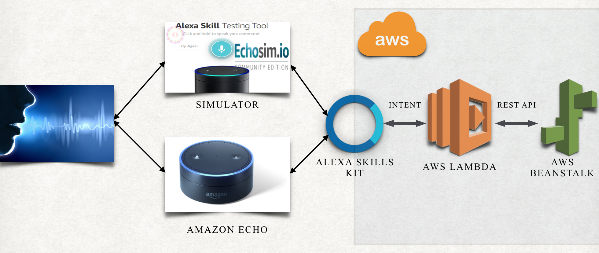

# alexa-fashion-news
Amazon Alexa - Fashion News Skill 

## Project description

Implementation of Fashion News Alexa Skill has the following steps:
<ul>
    <li>Alexa Skill created under <a href="https://developer.amazon.com/alexa-skills-kit">Amazon developer console</a> using Alexa Skills Kit (ASK) for german and english languages</li>
    <li>Serverless Lambda function created on AWS in Ireland region</li>
    <li>Backend deployed on AWS Elastic Beanstalk in Ireland region</li>
</ul>

Lambda function <a href="src/fashionNewsLambda.py">fashionNewsLambda</a> handles Alexa Skills Kit requests. Lambda fetches all data (e.g. news, articles, stores) from backend.
 
Backend - RESTful web service using Spring Boot and Spring Data (out of scope for this repository).
 

Skill has the following key utterances for english language (you could find all supported utterances under <a href="speechAssets">speechAssets</a> folder):
- What’s new on fashion
- Tell me latest fashion trends 
- Read the fashion article
- Where can I buy jeans nearby

This skill can build decision tree based on user's response. 
For example, after telling fashion trends, Alexa suggests to read today's fashion article.
 
## Architecture

Fashion News Skill has the following architecture:

## References
<a href="https://developer.amazon.com/alexa-skills-kit/alexa-skill-quick-start-tutorial">Alexa quick start tutorial</a>
 
<a href="https://developer.amazon.com/blogs/post/Tx2XUAQ741IYQI4/How-to-Build-a-Multi-Language-Alexa-Skill">Building Alexa skill for multiple languages</a>
 
<a href="https://echosim.io">Alexa simulator</a>

